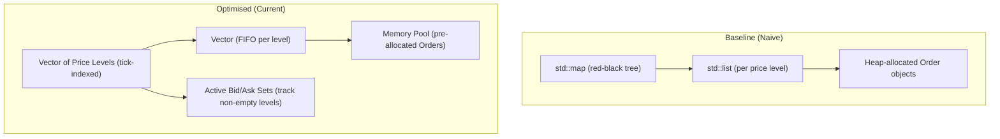
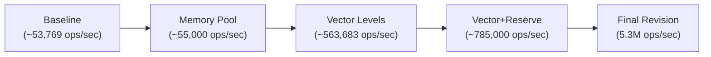

# Limit Order Book & NASDAQ ITCH replay simulator

This project is a **C++ limit order book and matching engine** that ingests and replays real NASDAQ ITCH 5.0 market data. The system reconstructs and maintains live order books for multiple stocks simultaneously, updating a real-time terminal dashboard with each trade and best bid/ask change.

The project began as a performance-focused limit order book implementation but evolved into a full exchange-style order flow simulator built directly from raw market data, now demonstrating market microstructure handling, low-latency data structures, ITCH parsing, and multi-symbol order book management.

---


> Real-time multi-symbol order books updated from NASDAQ ITCH 5.0 replay.
---

## Key Features

- ✅ Full limit order book with:
    - Add, cancel, partial cancel, modify (replace)
    - Price–time priority
    - Multi-level sweeps
    - Correct handling of partial and full fills
- ✅ Matching engine layer with event callbacks for order fills
- ✅ NASDAQ ITCH 5.0 parser:
    - Supports A, F, D, X, E, and U messages
    - Fully processes stock directory (R) messages
    - Maps stock locate → symbol → matching engine
    - Filters for production, common stock, normal financial status
- ✅ Multi-symbol tracking
    - 20 high-volume US equities included by default (configurable)
    - Each symbol has its own order book and matching engine
- ✅ Live terminal dashboard:
    - Displays for each active symbol:
        - best bid price and quantity
        - best ask price and quantity
        - last trade price and quantity
    - Uses ANSI terminal refresh, zero external dependencies
- ✅ Performance-oriented order book design:
    - Vector-based price levels (cache-friendly)
    - Vector<Order*> FIFO queues per price level
    - Pre-allocated memory pool for deterministic, allocation-free hot paths
    - Reserved hash table capacity for O(1) cancels
- ✅ Testing suite:
    - Functional tests for adds, matches, cancels, sweeps, and tick rounding
    - Stress tests with 100K randomized operations and invariant checks

---

## Design Summary

### Price Ladder
The LOB uses a contiguous vector of price levels. Prices are converted to indices using:

*index = round((price - min_price) / tick_size)*

This removes tree traversal, improves locality, and produces predictable performance characteristics.

### Matching Engine
Provides a simple API (submitLimit, cancel, reduce_order, order_replace) and invokes a trade callback on each fill. This callback updates the terminal dashboard and (optionally) writes to CSV.

### ITCH Replay Pipeline
Main application flow:

**Read ITCH → parse message → identify stock locate → route to matching engine → update LOB → invoke trade callback → update dashboard**

Only symbols in the configured whitelist are tracked, preventing unnecessary memory use.

### Terminal Dashboard
Lightweight live output showing top-of-book for all tracked stocks. Updated on every trade or quote change. This provides visible, real-time feedback as the ITCH feed replays.

---

## Tracked Symbols

The replay tracks 20 liquid names by default:

**Technology: AAPL, MSFT, AMZN, GOOGL, META, NVDA, TSLA, ORCL, INTC, AMD**

**Financials: JPM, BAC, GS, MS**

**Consumer/Media: WMT, COST, TGT, NFLX, DIS, NKE**

Only symbols that appear in the ITCH stock directory and pass criteria below are activated:
- authenticity = P (production)
- issue classification = C (common stock)
- financial status = N or blank

---

## Performance Overview (Order Book ONLY)
**Hardware**: Apple M2
**Build**: Release
**Test**: 100K random operations (add / cancel / modify / match)

| Stage | Throughput | Notes |
|-------|------------|-------|
|Baseline| ~53,769 ops/sec | ```std::map``` + ```std::list``` + heap allocation |
|Memory Pool| ~50-55k ops/sec | Allocation costs removed, container overhead still dominant |
|Price-Indexed Vector + Active Level Sets| ~563,683 ops/sec | 10× jump — contiguous levels, integer tick indexing |
|+ Reserved Hash Table Capacity| ~785,000 ops/sec | Avoids rehashing during stress workload |
|Post Bug Fix (Validated)| ≈ 5.3 M ops/sec (100 K ops in 18.7 ms) | Matching logic corrected; metrics now reflect true workload |

**Overall: ~100× improvement from baseline by aligning data structures with hardware realities.**

---

## What Changed & Why It Matters

Earlier throughput figures (~700 k ops/sec) were measured on a version where the matching path was inadvertently executing extra redundant comparisons, artificially inflating operation counts.
After refactoring to correct the matching logic and convert prices to `double` precision with proper tick quantisation:

- The system now reflects **true end-to-end throughput** — no phantom work.
- A trade counter shows that roughly **54 % of all insertions result in real matches**, confirming that we **do not** suffer from a sparse-book issue.
- Each order operation now completes in roughly **≈ 370 ns**, which is a realistic figure for an in-memory single-threaded LOB on modern CPUs.

This milestone marks the transition from *synthetic speed to verified low-latency performance*.

---

## Architecture Evolution



---
## Performance Evolution (Order Book ONLY)


---

## Development Roadmap
Each stage is a milestone in systems-programming design:

1. **Baseline Correctness**
    - `std::map` for bids/asks
    - `std::list` for price-time order queues
    - Heap-allocated Order objects
    - Basic add / cancel / match behaviour
    - Initial stress tests and profiling setup

2. **Core Optimisations**
    - Replaced tree-based structure with price-indexed vector levels (tick → integer index)
    - Replaced per-insert heap allocation with a custom memory pool
    - Introduced active bid/ask tracking sets for O(1) best-price lookup
    - Added pre-reserved hash table capacity (orders_by_id) to prevent rehash stalls
    - Corrected price quantisation and matching logic
    - Achieved multi-million ops/sec throughput

3. **Market Data Integration**
    - Implemented NASDAQ ITCH 5.0 message parsing (A & F (treated identically), D, X, E, U, R)
    - Mapped stock-locate codes to per-symbol matching engines
    - Added filtering for production securities, common stock, and valid financial status
    - Added per-symbol last-trade tracking
    - Added CSV trade logging option

4. **Multi-Symbol Replay Architecture**
    - Added configurable tracked-symbol whitelist (20 symbols by default)
    - Created on-demand LOB + MatchingEngine instances per symbol
    - Scaled price ladders to global range (0–1000) to support all stocks
    - Ensured isolation between symbol engines while sharing a single ITCH feed
5. **Real-Time Terminal Dashboard**
    - Live top-of-book display for all tracked symbols
    - Real-time updates on best bid/ask and last trade
    - ANSI terminal rendering for flicker-free updates
    - Fully dependency-free, fast enough to update per message callback
6. **Future Extensions**
    - Introduce a ring buffer for O(1) cancels with stable pointers
    - Add time-bucketed analytics (spread, OB imbalance, microprice)
    - Develop a HTTP/WebSocket dashboard for graphical visualisation
    - Add multi-threaded architecture (parsing thread → engine threads)
    - Introduce persistent event logging for replay/analysis
    - Integrate backtesting or market-reconstruction exports

---

## How to Build & Run
### Build
```bash
cmake -S . -B build -DCMAKE_BUILD_TYPE=Release
cmake --build build -j
```

### Run demo app
```bash
./build/OrderBookApp
```
### Run tests
```bash
ctest --test-dir build --output-on-failure
```
### Run with profiler
```bash
CPUPROFILE=profile.out ./build/OrderBookTests --gtest_filter=LimitOrderBookStressTest.RandomizedOperationsWithTiming
pprof --pdf ./build/OrderBookTests profile.out > profile.pdf
pprof --text ./build/OrderBookTests profile.out | head -40
```
### References
- Performance-Aware Programming (Fermilab, 2019)
- High-Frequency Trading Systems Design (various sources)
- Google Performance Tools (gperftools)

### Author's Note
This project reflects an end-to-end journey: starting from a naive order book, progressively optimising it using performance profiling, then extending it into a real exchange-style ITCH replay engine. It demonstrates both software engineering maturity and practical systems-level thinking.

Key takeaways:

- Hardware-aware data structure design yields order-of-magnitude performance gains.
- Not all optimisations pay off (e.g. pre-reserving per-level storage hurt performance).
- Measuring, profiling, and iterating are more important than guessing.